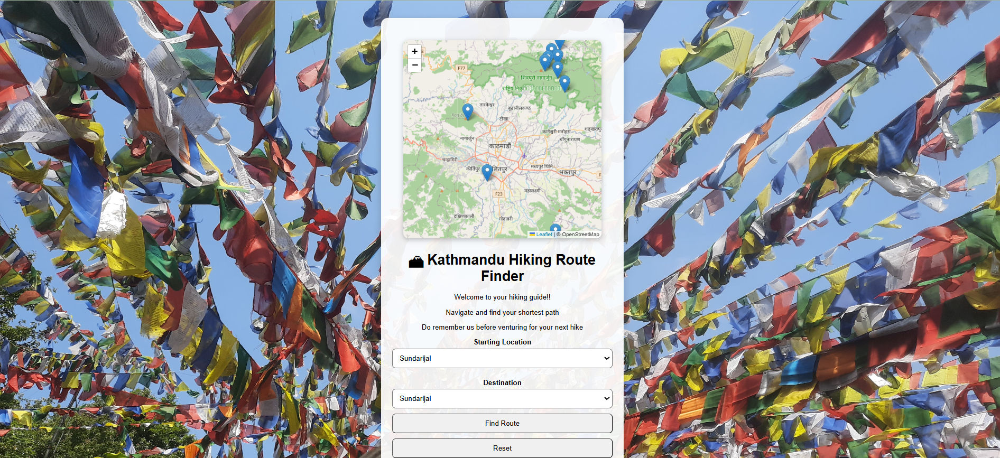
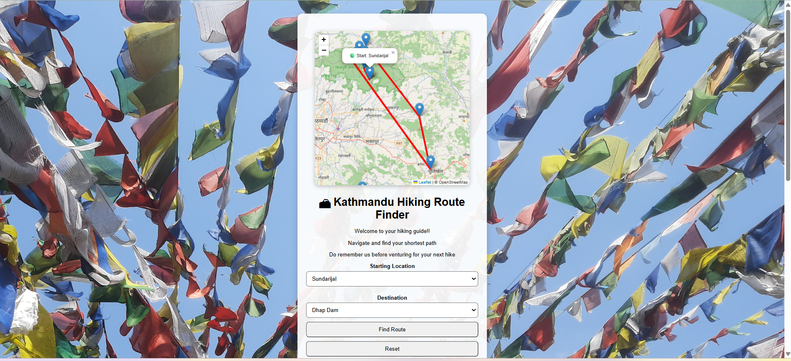
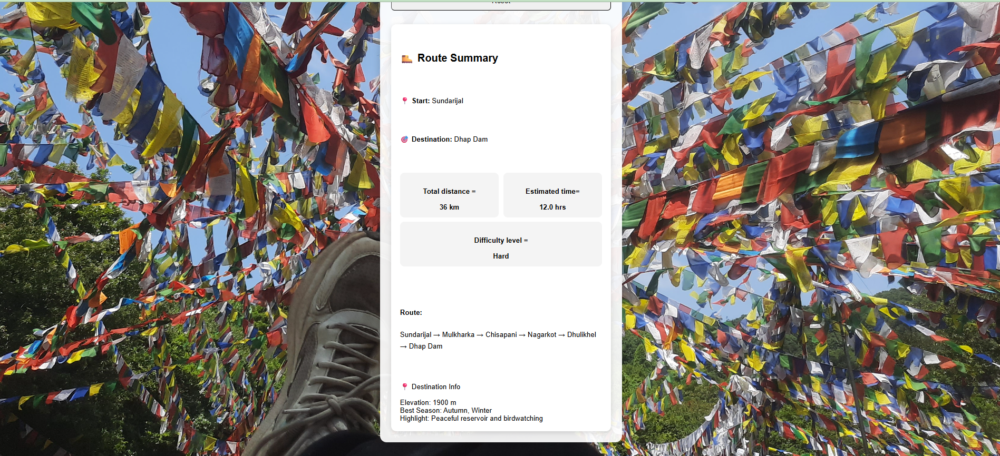

# 🏔 Kathmandu Hiking Route Finder

A web-based hiking route planner for popular hiking destinations in Kathmandu Valley. The application uses **Dijkstra's Algorithm** to calculate the shortest hiking route and visualizes trails on an interactive **Leaflet** map.

Users can estimate hiking distance, time, and difficulty while exploring hiking destinations around Kathmandu.

# Demo
https://ipshu-codes.github.io/hiking-routes/ 

# Homepage



# MAP



# Route Summary




## Features

- Find the shortest hiking route using Dijkstra's Algorithm
- Interactive Leaflet map with OpenStreetMap
- Start and destination markers
- Total hiking distance
- Estimated hiking time
- Route difficulty (Easy, Moderate, Hard)
- Route color changes according to difficulty
- Destination information
- Mobile responsive design
- Reset route functionality
## Hiking Locations

- Sundarijal
- Mulkharka
- Manichud
- Chisapani
- Nagarkot
- Dhulikhel
- Dhap Dam
- Shivapuri Peak
- Nagi Gumba
- Jamacho
- Champadevi
- Phulchoki

## Technologies Used


- HTML5
- CSS3
- JavaScript (ES6)
- Leaflet.js
- OpenStreetMap
- Git & GitHub

## Algorithm

The application models hiking destinations as a weighted graph, where each location is a node and each hiking trail is an edge with an associated distance.

It uses **Dijkstra's Algorithm** to calculate the shortest available hiking route between the selected start and destination.

## Highlights

- Implemented Dijkstra's shortest path algorithm
- Interactive hiking map using Leaflet
- Express.js backend serving trail information
- Modular project structure


## Future Improvements

* Draw routes directly on the map
* Add elevation profiles
* Display estimated hiking time
* Add difficulty ratings for routes

## Installation

Clone the repository:

```bash
git clone https://github.com/Ipshu-codes/hiking-routes.git
```

Navigate to the project:

```bash
cd hiking-routes
```

Install dependencies:

```bash
npm install
```

Start the server:

```bash
node server.js
```

Open your browser:

```
http://localhost:3000
```

## Author

Ipshu Upreti
